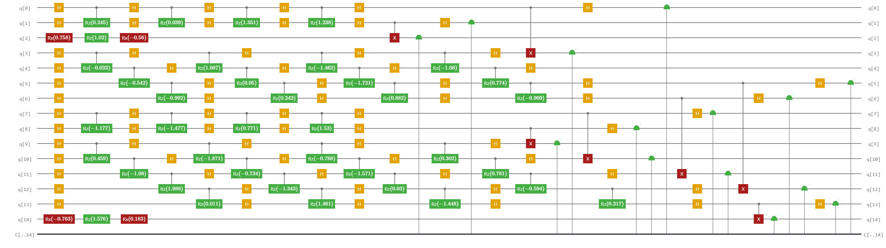
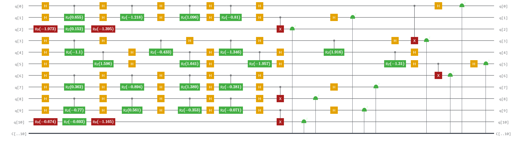

# Dice Roll Action Generating Operational Network

Welcome to the _Dice Roll Action Generating Operational Network (DRAGON)._
The project was completed by Shawn Bray, Josh Li, and Reece Robertson in fulfillment of the course requirements for Dr. Lara Martin's _CMSC 691—Interactive Fiction and Text Generation_ at the University of Maryland, Baltimore County.
A complete demonstration video for this project can be found at: [https://umbc.webex.com/umbc/ldr.php?RCID=3fa1cc86aa42eb0f334fae3eef62663a](https://umbc.webex.com/umbc/ldr.php?RCID=3fa1cc86aa42eb0f334fae3eef62663a).

## Introduction

DRAGON is a system which generates action effect descriptions in response to player input.
The output of the model is evaluated using a quantum cost function, along with the traditional BLEU and ROGUE metrics.

This document outlines the requirements and setup required to run DRAGON, and then provides instructions for gameplay and a complete example.
Following this is a discussion of the **LAMBEQ Score**, a novel method of natural language sentence similarity evaluation using the [Quantinuum Lambeq](https://cqcl.github.io/lambeq-docs/) Python package.
The LAMBEQ score leverages quantum states for its comparison, and represents an exciting foray into quantum natural language processing.
Finally, this document concludes with a project status statement.

### LLM Use Statement
We did not use an LLM to generate any part of our code files, our report file, or this document.
We do use the Llama 2 LLM to generate response descriptions to player actions.

## Requirements

This project utilizes one of Meta's [Llama 2](https://huggingface.co/meta-llama/Llama-2-7b-chat-hf) large language models.
In order to access this model, one wishing to run our system must complete the following steps:
1. Create a [Hugging Face](https://huggingface.co/) account.
2. In your [token settings](https://huggingface.co/settings/tokens), generate an access token with write permissions. 

## Setup Instructions

For best results we recommend uploading a copy of `final_project.ipynb` to [Google Colab](https://colab.research.google.com/).
To see Shawn's version of the project, you can upload a version of `shawn_final_project.ipynb` instead.
Then select `Runtime->Run All` to execute all cells of the notebook.
In the first cell you will be propted to input the Hugging Face access token you generated in the second step of the **Requirements** section.
Following this you will be prompted to `Add token as a git credential? (Y/n)`,to which you can reply with `n`.
That completed, scroll down to the end of the notebook to find the section entitled **Run the Game**.
Wait for this cell to execute, and then enjoy!

## Usage Instructions

Once the final cell of the notebook begins to execute, gameplay begins.
Gameplay in DRAGON consists of a series of turns.
First, the DRAGON will query Meta's Llama 2 model to generate some text.
On the first turn, this will be a brief description of the fantasy world in which the player now finds themself.
On subsequent turns, this will be a brief description of the effect of the prior turn's action.

Following DRAGON's prompt, the player may then type a natural language sentence to describe their desired action.
DRAGON will augment this text description with a randomly generated dice roll result, and prompt the Llama 2 model to generate a description for the resulting action.
The model is instructed to generate a two-part output: first, there should be a six-word sentence describing the success or failure value of the action, and second, there should follow a 2-3 sentence natural language description of the action result.
The first sentence is then compared to a success/failure sentence hypothesis given the dice result.
This comparison is made using the [BLEU](https://www.nltk.org/api/nltk.translate.bleu_score.html) score, the [ROGUE](https://pypi.org/project/rouge-score/) score, and a new evaluation metric called the LAMBEQ score, which is described below in the **LAMBEQ Score** section.
The validation values of all three metrics are printed to the screen, and then a new turn begins.
Turns continue indefinitely until the player instructs the model to `quit`.
The following section presents an example of gameplay.

## Example Gameplay

> Welcome to the AI Generated Adventure!

> Your situation: You are creating an interactive fiction game. Describe the initial setting and situation the player finds themselves in. Keep it to 2-3 sentences.

> The player finds themselves in a small village nestled in the heart of a dense forest. The village is surrounded by towering trees, their branches stretching towards the sky like bony fingers. The air is crisp and clean, filled with the sweet scent of blooming wildflowers. As the player looks around, they notice the villagers going about their daily routines, their faces etched with worry and fear.

> What would you like to do? (type 'quit' to end)
> Your action was a critical success.

> [DICE ROLL: 1]

> The player discovers a hidden entrance to a secret underground cave system. The entrance is hidden behind a waterfall, and the player must use their quick reflexes to avoid the falling water and reach the cave. Once inside, the player finds themselves in a vast network of tunnels and chambers filled with ancient artifacts and mysterious symbols.

> \> What do you want to do next?
> 
> Target:		 The player discovers a hidden entrance
> 
> Hypothesis:	 Your action was a critical failure.
> 
> BLEU:		 0.3333333333333333
> 
> ROUGE:		 0.16666666666666666
> 
> LAMBEQ:		 -1.0

> \> What would you like to do? (type 'quit' to end)
> 
> Your action was a major success.

> [DICE ROLL: 15]

> You find yourself in a dark and ominous cave, the air thick with the scent of damp stone and mold. The sound of dripping water echoes through the cavern, and you can hear the distant howling of wolves. You notice a faint light in the distance, and you realize that it must be coming from a nearby torch. You can choose to follow the light and see where it leads, or you can decide to explore the cave further and see what other secrets it holds. What do you want to do next?
> 
> Target:		 You find yourself in a dark
> 
> Hypothesis:	 Your action was a regular success.
> 
> BLEU:		 0.2599206349206349
> 
> ROUGE:		 0.16666666666666666
> 
> LAMBEQ:		 1.0

> What would you like to do? (type 'quit' to end)
> 
> Your action was a slight success.

> [DICE ROLL: 2]

> You manage to find the hidden entrance to the underground cave system, and you discover a hidden chamber filled with ancient artifacts and mysterious symbols. You notice a strange glow emanating from the walls, and you realize that the chamber must be filled with magical energy. As you explore the chamber further, you hear a faint whispering in the distance, and you realize that you are not alone in the cave. A group of goblins has discovered your presence, and they are closing in on you. What do you want to do next?
> 
> Target:		 You manage to find the hidden
> 
> Hypothesis:	 Your action was a major failure.
> 
> BLEU:		 0.2222222222222222
> 
> ROUGE:		 0.011121
> 
> LAMBEQ:		 -1.0

What would you like to do? (type 'quit' to end)

> Your action was a moderate failure.

> [DICE ROLL: 20]

> The goblins suddenly appear from the shadows, brandishing crude weapons and snarling with ferocity. They outnumber you and are closing in fast, their eyes gleaming with malice. You realize that you must act quickly to avoid being overwhelmed. You can choose to fight the goblins head-on, or you can try to retreat and find a better defensive position. What do you want to do next?

> Please provide your response.
> 
> Target:		 The goblins suddenly appear from the
> 
> Hypothesis:	 Your action was a critical success.
> 
> BLEU:		 0.3472222222222222
> 
> ROUGE:		 0.0
> 
> LAMBEQ:		 -1.0
>
> What would you like to do? (type 'quit' to end)
> 
> quit

> Thanks for playing!
>
>

## Results

*Figure 1: Generated circuit for final target*

Target Circuit Performance Metrics: {'gate_depth': 41, 'gate_count': 180, 'execution_time_estimate': '18 ms'}
>
>

*Figure 2: Generated circuit for final hypoyhesis*

Hypothesis Circuit Performance Metrics: {'gate_depth': 33, 'gate_count': 86, 'execution_time_estimate': '8.6 ms'}
>

## Evaluation Comparison

Comparison of Circuit Performance Metrics:
> 
> gate_depth_difference: 8
> 
> gate_count_difference: 94
> 
> execution_time_difference (ms): 9.4
> 

## LAMBEQ Score

The _LAMBEQ score_ is a new similarity evaluation metric introduced by the DRAGON system.
As mentioned above, this metric is built using Quantinuum Lambeq, which is a quantum natural language processing package for Python.
It also utilizes [Quantinuum Tket](https://docs.quantinuum.com/tket/), a Python package for quantum circuit representation and evaluation, and [IBM Qiskit](https://www.ibm.com/quantum/qiskit), a similar tool to Tket, used here to execute quantum circuits on a simulated hardware backend.

The LAMBEQ score is evaluated using the following steps:
1. Two natural language sentences are input into the LAMBEQ score function.
2. These sentences are decomposed into DisCoCat grammatical string diagrams using Lambeq's `sentence2diagram` function.
3. These string diagrams are compiled into quantum circuit objects using a Lambeq quantum ansatz.
4. All parameterized gates in each circuit are populated with a constant value, which completes the embedding of the natural language sentences into a quantum representation.
5. The expectation value of each circuit is computing (we chose to perform this computation using an IBM Quantum `AerBackend` simulator and a Z-basis measurement observable, but any quantum device and measurement observable can be used).
6. The distance between the expectation values is computed using a similarity function, which outputs a real number between 0 and 1 that represents the relative similarity of the two input sentences.

## Project Status

This project is completed.
We have no intent of continuing this work, accepting pull requests, or accepting other contributions.
